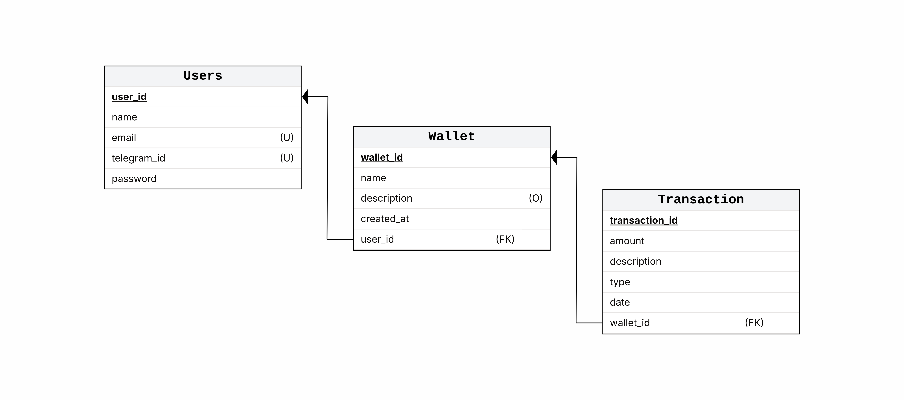

# 🟣 Zaldo - Financial Bot


> **Zaldo** (do latim *Saldo* com um toque moderno) é um Bot de Finanças Pessoais para Telegram de alto desempenho, desenhado para simplificar o registro de gastos e receitas através de uma interface de chat intuitiva, alimentado por uma API REST robusta.

---

## 📋 Índice

* [Funcionalidades](#-funcionalidades)
* [Tech Stack & Arquitetura](#-tech-stack--arquitetura)
* [Como Executar](#-como-executar)
* [Configuração (.env)](#-configuração)
* [Documentação da API](#-documentação-da-api)
* [Estrutura do Projeto](#%EF%B8%8F-estrutura-do-projeto)

---

## ✨ Funcionalidades

O Zaldo permite gerenciar suas finanças sem sair do Telegram.

* **🤖 Bot Interativo:** Navegação via Menus e Botões (Inline Keyboards).
* **🔐 Segurança:** Autenticação de usuários e proteção de dados.
* **💰 Gestão de Carteiras:** Crie múltiplas carteiras (Ex: *Nubank*, *Cofre*, *Investimentos*) e gerencie saldos individuais.
* **📝 Transações Rápidas:**
    * Registro de **Despesas** e **Receitas**.
    * Classificação por Categorias (Alimentação, Lazer, Transporte, etc.).
    * Datas personalizadas (hoje, ontem ou data específica).
* **⚡ Performance:** Cache de sessão de usuário utilizando **Redis** (Cache-Aside Pattern) para respostas imediatas.

---

## 🚀 Tech Stack & Arquitetura

O projeto foi desenhado seguindo as melhores práticas de engenharia de software para garantir manutenibilidade e desacoplamento.

* **Linguagem:** [Java 25](https://jdk.java.net/25/) (Preview Features)
* **Framework:** Spring Boot 3.x
* **Arquitetura:** Hexagonal (Ports & Adapters)
* **Banco de Dados:** PostgreSQL 18.1
* **Cache & Sessão:** Redis 8.4
* **Containerização:** Docker & Docker Compose
* **Integração:** Telegram Bot API
* **API Client:** [Bruno](https://www.usebruno.com/) (Coleção inclusa em `/zaldo`)

### Esquema do Banco de Dados
O sistema utiliza integridade referencial robusta com `ON DELETE CASCADE` configurado via JPA para garantir consistência entre Usuários, Carteiras e Transações.



---

## 🛠️ Como Executar

### Pré-requisitos
* Docker e Docker Compose instalados.
* Um Token de Bot do Telegram (fale com o [@BotFather](https://t.me/BotFather)).

### Passo a Passo (Docker)

A maneira mais fácil de rodar o Zaldo é via Docker, pois ele sobe o Banco, o Redis e a API automaticamente.

1.  **Clone o repositório:**
    ```bash
    git clone https://github.com/williansilva51/zaldo.git
    cd zaldo-api
    ```

2.  **Configure as Variáveis de Ambiente:**
    Crie um arquivo `.env` na raiz (baseado no `.env-example`):
    ```bash
    cp .env-example .env
    ```
    *Edite o arquivo e insira seu `TOKEN_TELEGRAM_BOT`.*

3.  **Execute com Docker Compose:**
    ```bash
    docker compose up --build
    ```

4.  **Acesse:**
    * A API estará rodando em: `http://localhost:8080`
    * O Bot estará ativo no seu Telegram.

---

## ⚙️ Configuração

O sistema é configurado via variáveis de ambiente para facilitar o deploy em contêineres.

| Variável | Descrição | Padrão (Dev) |
| :--- | :--- | :--- |
| `TOKEN_TELEGRAM_BOT` | Token fornecido pelo BotFather | **Obrigatório** |
| `TOKEN_JWT` | Segredo para assinatura de Tokens | `dev-secret...` |
| `DB_NAME` | Nome do banco PostgreSQL | `zaldo` |
| `DB_USER` | Usuário do banco | `admin` |
| `DB_PASSWORD` | Senha do banco | `admin` |
| `SPRING_DATA_REDIS_HOST` | Host do Redis | `redis` (no docker) |

---

## 📖 Documentação da API

O projeto possui integração com **Swagger UI** para exploração dos endpoints REST.

Após iniciar a aplicação, acesse:
👉 **[http://localhost:8080/scalar](http://localhost:8080/scalar)**

---

## 🏗️ Estrutura do Projeto

O código segue rigorosamente a **Arquitetura Hexagonal**, isolando o domínio de dependências externas.

```text
zaldo-api/
├── core/                      # 🟢 O Coração (Regras de Negócio Puras)
│   ├── domain/                # Entidades (Transaction, User, Wallet)
│   └── enums/                 # Categorias e Tipos
├── application/               # 🟡 Casos de Uso (Orquestração)
│   ├── ports/                 # Interfaces que definem Entradas e Saídas
│   └── service/               # Implementação dos Casos de Uso
└── infrastructure/            # 🔴 O Mundo Externo (Frameworks & IO)
    ├── adapters/
    │   ├── in/                # Quem chama a aplicação (Web Controller, Telegram Handler)
    │   └── out/               # Quem a aplicação chama (Postgres Repository, Redis)
    └── config/                # Configurações do Spring (Security, Scalar, Beans)